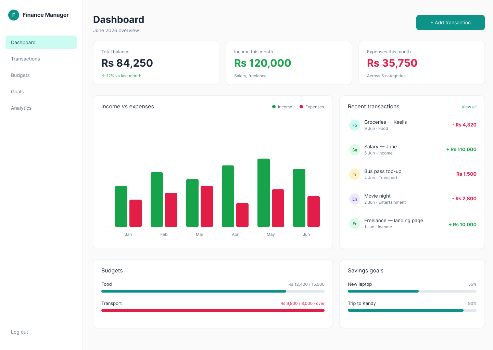
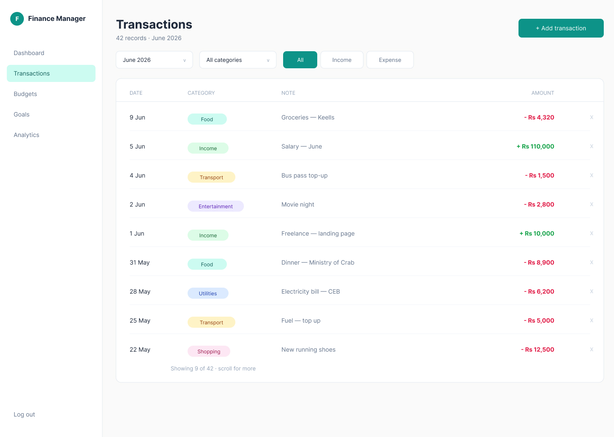
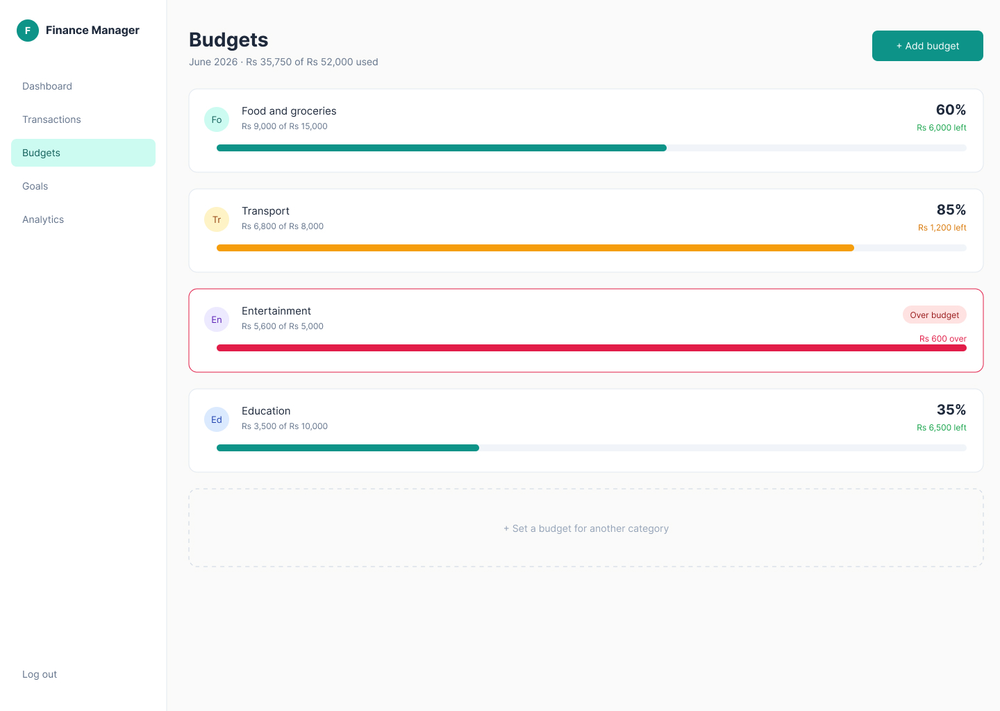
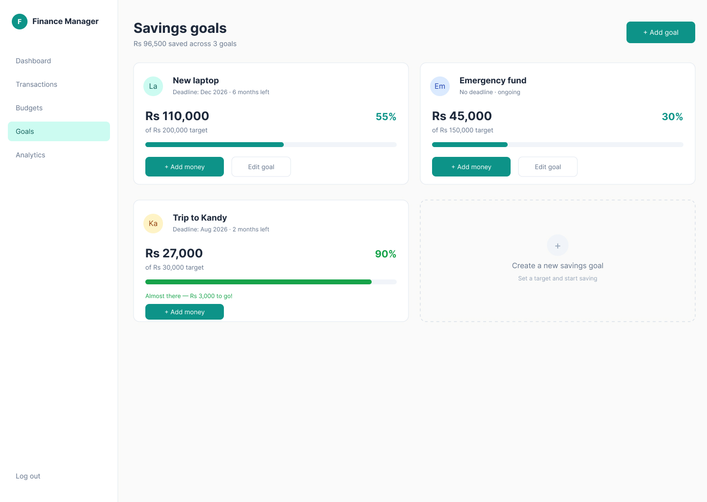
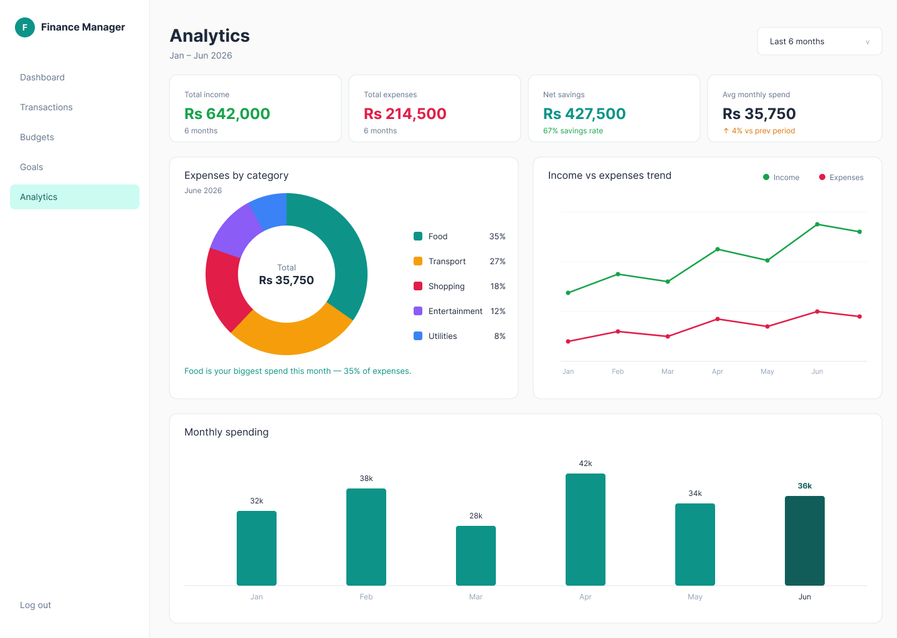

# finance-manager
Personal finance manager — track income, expenses, budgets, and savings goals. Built with React, Tailwind, and Supabase.
# Finance Manager

A personal finance manager to track income, expenses, budgets, and savings goals — with an analytics dashboard that turns raw transactions into clear insights.

🔗 **Live demo:** _coming soon_ · 

🎨 **Figma file:** (https://www.figma.com/design/HlAHMMO5ElTNkXm1vPNc4d/Finance-mannger?m=auto&t=8ST4aKewDtI4klG1-1)

---

## Features

- **Authentication** — secure sign-up and login, each user sees only their own data
- **Transactions** — add, filter, and delete income and expense records
- **Budgets** — set monthly limits per category with visual progress and over-budget warnings
- **Savings goals** — track progress toward targets with deadlines
- **Analytics dashboard** — category breakdown, income-vs-expense trends, and monthly spending charts

---

## Screens

### Dashboard

### Transactions

### Budgets

### Savings goals

### Analytics

---

## Tech stack

| Layer | Technology |
|----------|-------------|
| Frontend | React (Vite) |
| Styling | Tailwind CSS |
| Backend / DB | Supabase (PostgreSQL + Auth) |
| Charts | Recharts |
| Deployment | Vercel |

---

## Design process

This project started with a design phase before any code was written:

1. **User flow** — mapped the journey from sign-up through the four core screens.
2. **Wireframes** — low-fidelity layouts to decide structure before visuals.
3. **Design system** — a single set of colors, typography, and components reused across every screen.
4. **High-fidelity mockups** — the visual target the build was measured against.

**Key decisions:** income is shown in green and expenses in rose *consistently* across the whole app to reduce the effort of scanning; budget status is shown two ways (color **and** label) so it works for colorblind users; and the add-transaction form is a modal to keep users in context.

Full wireframes and mockups are in the [Figma file](https://www.figma.com/design/HlAHMMO5ElTNkXm1vPNc4d/Finance-mannger?m=auto&t=8ST4aKewDtI4klG1-1) and in `Desighn`.

---

## Project status

🚧 In active development. Built over one week as a portfolio project.

- [x] Project setup (Vite + React + Tailwind)
- [x] Supabase auth
- [ ] Transactions
- [ ] Budgets
- [ ] Savings goals
- [ ] Analytics dashboard
- [ ] Deployment

---

## Author

Built by **Hansaka R Bandara** 

- GitHub: [HΞNSKΛ™](https://github.com/Hansaka-co)